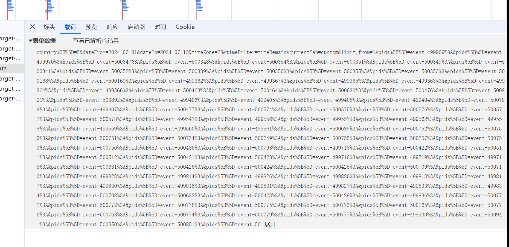
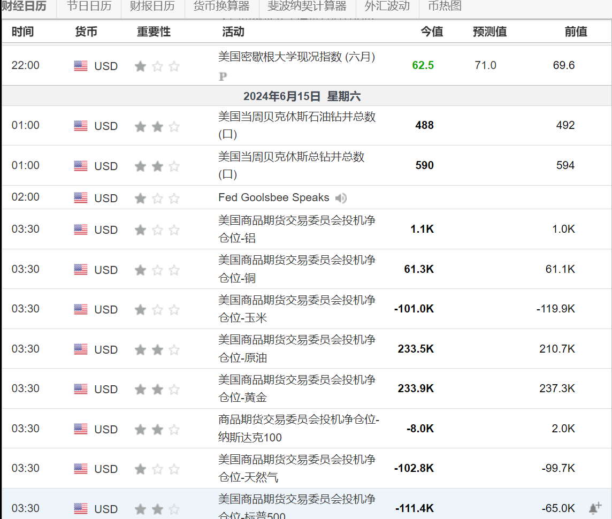

# investing爬取分析


**注意英文和中文网站分析是一样的只是URL不同**

**本文以中文investing为例**


筛选好日期和国家后往下滑发现只有三页数据，如果需要指定日期需要自己在页面上看有多少页数据

api接口 ：https://cn.investing.com/economic-calendar/Service/getCalendarFilteredData 



可以看出表单数据很长 ，而且post请求得传字符串进去跟传统的data = dict{}不同，不传字符串轻则数据为假数据重则无数据返回。

先爬取首页的列表页的字段 然后 进入详情页 提取字段 最后合并 




## 首页列表页字段xapth 语法 


先定位到父节点 然后for循环遍历查找对应字段 

有两个父节点  

```python

  data1 = tree.xpath('//tr[@class="js-event-item "]')
  data2 = tree.xpath('//tr[@class="js-event-item revised"]')
  
      for i1 in data1:
      	detail_url1 = "https://cn.investing.com" + i1.xpath('./td[4]/a/@href')[0]

        b = {"时间": i1.xpath('./@data-event-datetime')[0],
        "货币": i1.xpath('./td[2]/text()')[0].strip(),
        "活动": i1.xpath('./td[4]/a/text()')[0].strip(),
        "今值": i1.xpath('./td[5]/text()')[0].strip(),
        "预测值": i1.xpath('./td[6]/text()')[0].strip(),
        "前值": i1.xpath('./td[7]/span/text()')[0].strip(),
        }
   

    for i2 in data2:
        c = {"时间": i2.xpath('./@data-event-datetime')[0].strip(),
             "货币": i2.xpath('./td[2]/text()')[0].strip(),
             "活动": i2.xpath('./td[4]/a/text()')[0].strip(),
             "今值": i2.xpath('./td[5]/text()')[0].strip(),
             "预测值": i2.xpath('./td[6]/text()')[0].strip(),
             "前值": i2.xpath('./td[7]/span/text()')[0].strip(),
             }

        detail_url2 = "https://www.investing.com" + i2.xpath('./td[4]/a/@href')[0]

       

```


## 详情页xpath语法


```
res2 = requests.get(detail_url, headers=headers, cookies=cookies)

tree = etree.HTML(res2.text)
b = {"最新发布": tree.xpath('//*[@id="releaseInfo"]/span[1]/div/text()')[0].strip() if tree.xpath(
'//*[@id="releaseInfo"]/span[1]/div/text()') else "",
"来源": tree.xpath(
'//div[@id="overViewBox"]/div[@class="clear"]/preceding-sibling::div[1]/div[4]/span[2]/a/text()')[
0].strip() if
tree.xpath(
'//div[@id="overViewBox"]/div[@class="clear"]/preceding-sibling::div[1]/div[4]/span[2]/a/text()') else "",
"info": tree.xpath('//div[@class="left"]/text()')[0] if tree.xpath('//div[@class="left"]/text()') else ""}
```


## 总体流程 （以当前6.1-7.15为例）


三页数据 大约600条列表页 如果使用单线程 速度太慢 所以用多线程

单线程大概需要10分钟  多线程1分钟  


思路：

把每个首页的200个列表页字段存到队列中，然后拼接详情页url 进入提取到详情页字段

把详情页字段也存入到队列  

然后取出这两个队列的数据  进行合并  把合并的数据存到队列 然后取出来放到列表里 

最后保存为json文件

相关代码如下

```
# 把所有的详情页url放到队列

    for page in range(1, 4):
        get_data(str(i))
    thread_list = []
    for thread_num in range(10):
        t = threading.Thread(target=parse_detail_url)
        thread_list.append(t)
    for thread_num1 in range(10):
        t2 = threading.Thread(target=save_data)
        thread_list.append(t2)

    for i in thread_list:
        # 设置守护线程
        i.setDaemon(True)
        i.start()
    for q in [save_detail_url_que, save_index_que]:
        q.join()  # 让主线程阻塞，等待队列的计数为0
```

最后保存数据 

```
    with open('investing_chinese1.json', 'w', encoding='utf-8') as f:
        f.write(json.dumps(data_list, ensure_ascii=False, indent=4))
```


