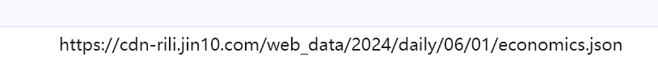
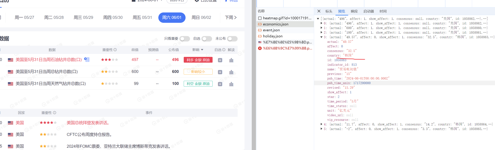

# readme

api 接口： https://cdn-rili.jin10.com/web_data/2024/daily/06/01/economics.json 

URL参数为日期 如图所示



处理方式  以6月1日到7月15日为例 

处理成 2024/daily/06/1

```
start_date = datetime(2024, 6, 1)  # 6月1日
        end_date = datetime(2024, 7, 16)  # 7月16日，但不包括该日期

        # 循环输出日期
        current_date = start_date
        while current_date < end_date:
            date = current_date.strftime('%Y/%m/%d')  # 格式化输出日期为 YYYY/MM/DD
            # 将日期字符串分割成年、月、日
            year, month, day = date.split('/')

            # 构建新的日期字符串
            new_date_str = f"2024/daily/{month}/{day}"

            url = f"https://cdn-rili.jin10.com/web_data/{new_date_str}/economics.json"

            current_date += timedelta(days=1)  # 增加一天，继续循环
            
```

已经筛选了美国的但是返回数据依然有其他国家数据所以需要筛选




```
 判断是否是美国   if i['country'] == "美国":
```


使用scrapy来编写爬虫代码 

先爬取首页的字段  然后在通过meta传过去 解析详情页字段 最后合并  

yield 合并后的数据   在管道里存储 添加到列表里面 

爬虫结束  把列表写入json文件 


相关代码

解析首页 把字段通过meta传递 

```
    def parse(self, response):
        try:
            for i in response.json():
                if i['country'] == "美国":
                    time = timestamp_to_time(i['pub_time_unix'])
                    id = i['id']
                    detail_url = f"https://rili.jin10.com/detail/{id}"
                    yield scrapy.Request(url=detail_url, callback=self.parse_detail,
                                         meta={"时间": time, "数据": i['country'] + i['time_period'] + i['name'],
                                               "重要性": i['star']
                                               })
        except Exception as e:
            print("出错了")
```

接收首页的meta 合并详情页字段  传递给管道 

 ```
    def parse_detail(self, response):

        c = {"最新发布": response.xpath(
            "//div[@class='detail-page']/div[2]/div[1]/div[2]/text()").extract_first().strip().replace("--", ""),
             "公布值": response.xpath(
                 "//div[@class='detail-page']/div[2]/div[2]/div[2]/text()").extract_first().strip().replace("--", ""),
             "预测值": response.xpath(
                 "//div[@class='detail-page']/div[2]/div[3]/div[2]/text()").extract_first().strip().replace("--", ""),
             "前值": response.xpath(
                 "//div[@class='detail-page']/div[2]/div[4]/div[2]/text()").extract_first().strip().replace("--", ""),
             "下次公布时间": response.xpath(
                 "//div[@class='detail-page']/div[2]/div[5]/div[2]/text()").extract_first().strip().replace("--", ""),
             "发布频率": response.xpath(
                 "//div[@class='detail-page']/div[2]/div[6]/div[2]/text()").extract_first().strip().replace("--", ""),
             "数据释义": response.xpath(
                 "//div[@class='detail-page']/table/tbody/tr[1]/td[2]/text()").extract_first().strip().replace("--",
                                                                                                               ""),
             "数据影响": response.xpath(
                 "//div[@class='detail-page']/table/tbody/tr[2]/td[2]/text()").extract_first().strip().replace("--",
                                                                                                               ""),
             "统计方法": response.xpath(
                 "//div[@class='detail-page']/table/tbody/tr[3]/td[2]/text()").extract_first().strip().replace("--",
                                                                                                               ""),
             "公布机构": response.xpath(
                 "//div[@class='detail-page']/table/tbody/tr[4]/td[2]/text()").extract_first().strip().replace("--",
                                                                                                               "")}
        b = {"时间": response.meta['时间'], "数据": response.meta['数据'], "重要性": response.meta['重要性']}
        b.update(c)
        yield b
 ```

接收传递过来的数据 进行保存 

```
data_list = []
class HaiwaiPipeline:
    def open_spider(self, spider):
        if spider.name == "gu":
            print("爬虫开始")
    def process_item(self, item, spider):
        if spider.name == "gu":
            data_list.append(item)
    def close_spider(self, spider):
        with open('jin10chinese.json', 'w', encoding='utf-8') as f:
            json.dump(data_list, f, ensure_ascii=False, indent=4)

```


