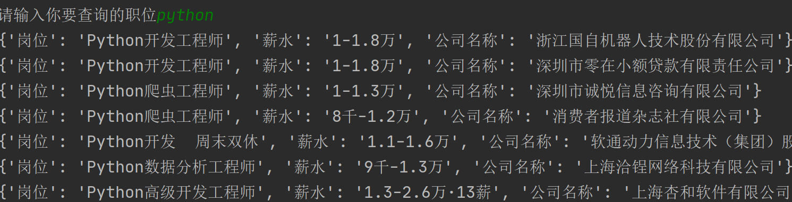

# 2024前程无忧爬虫

## 免责声明

该文章为学习使用，严禁用于商业用途和非法用途，否则由此产生的一切后果均与作者无关！如有侵权，请私信联系作者删除

## 分析

地址:aHR0cHM6Ly93ZS41MWpvYi5jb20vcGMvc2VhcmNoP2tleXdvcmQ9JUU0JUJDJTlBJUU4JUFFJUExJnNlYXJjaFR5cGU9MiZzb3J0VHlwZT0wJm1ldHJv

随便抓一个包，看到有sign acw_sc__v2 这两个疑似加密

然后复制curbash直接发请求测试 

把sign注释 有数据  把acw_sc__v2注释  返回一段js

然后把网站上的cookie清空  刷新网页  hook acw_sc__v2 

hook脚本如下：

~~~
(function () {
// 严谨模式 检查所有错误
    'use strict';
// document 为要hook的对象 这里是hook的cookie
    var cookieTemp = "";
    Object.defineProperty(document, 'cookie', {
        // hook set方法也就是赋值的方法
        set: function (val) {
            // 这样就可以快速给下面这个代码行下断点
            // 从而快速定位设置cookie的代码
            if (val.indexOf('acw_sc__v2') != -1) {
                debugger;
            }
            console.log('Hook捕获到cookie设置->', val);
            cookieTemp = val;
            return val;
        }, // hook get 方法也就是取值的方法
        get: function () {
            return cookieTemp;
        }
    });
})();
~~~

**注意**：acw_sc__v2一定要写对   写错拿不到数据  

成功断住如下图：

然后跟栈分析 ：

arg3就是acw_sc__v2的值

然后往上看  扣一下代码  

arg3一开始是一个空字符串  然后经过for循环生成了值

从postList开始扣 然后放到node里面跑   代码如下

~~~
var posList = [15, 35, 29, 24, 33, 16, 1, 38, 10, 9, 19, 31, 40, 27, 22, 23, 25, 13, 6, 11, 39, 18, 20, 8, 14, 21, 32, 26, 2, 30, 7, 4, 17, 5, 3, 28, 34, 37, 12, 36];
                var mask = _0x1e8e("0x0");
                var outPutList = [];
                var arg2 = "";
                var arg3 = "";
                for (var i = 0; i < arg1[_0x1e8e("0x1")]; i++) {
                    var this_i = arg1[i];
                    for (var j = 0; j < posList[_0x1e8e("0x1")]; j++) {
                        if (posList[j] == i + 1) {
                            outPutList[j] = this_i
                        }
                    }
                }
                arg2 = outPutList[_0x1e8e("0x2")]("");
                for (var i = 0; i < arg2[_0x1e8e("0x1")] && i < mask[_0x1e8e("0x1")]; i += 2) {
                    var GxjQsM = _0x1e8e("0x3")[_0x1e8e("0x4")]("|")
                      , QoWazb = 0;
                    while (!![]) {
                        switch (GxjQsM[QoWazb++]) {
                        case "0":
                            if (xorChar[_0x1e8e("0x1")] == 1) {
                                xorChar = "0" + xorChar
                            }
                            continue;
                        case "1":
                            var strChar = parseInt(arg2[_0x1e8e("0x5")](i, i + 2), 16);
                            continue;
                        case "2":
                            arg3 += xorChar;
                            continue;
                        case "3":
                            var xorChar = (strChar ^ maskChar)[_0x1e8e("0x6")](16);
                            continue;
                        case "4":
                            var maskChar = parseInt(mask[_0x1e8e("0x5")](i, i + 2), 16);
                            continue
                        }
                        break
                    }
                }
~~~

运行 报错

~~~
 var mask = _0x1e8e("0x0");
ReferenceError: _0x1e8e is not defined
~~~

这时候我们去浏览器看是什么 

发现就是一个字符串  3000176000856006061501533003690027800375 

继续跑 arg1报错  给一个arg1值  ""E1744785B6196E58D8E33D6A0410AB0F6A6284B0" "

~~~
ReferenceError: arg1 is not defined
~~~

报错

~~~
ReferenceError: _0x1e8e is not defined
~~~

看到这里可以发现都是一些类似的变量  _0x1e8e

去浏览器里面找 _0x1e8e("0x1")就是length

同理  其他的也是一样的  就不带着找了    把这些替换掉 就可以出值了

替换后 console.log(arg3)跟下面的值一样就没有问题了

然后看发包情况

一共发了两次包

第一次返回js 第二次携带acw_sc__v2 就可以拿到数据

然后第一次返回的用正则表达式来提取arg1  通过arg1来生成arg3  arg3就是acw_sc__v2的值

以下步骤就很简单了 就不带着写了

## 源码获取

**未经允许不得转载**

放一张成功的图片

**公众号** :庆哥爬虫  关注公众号发送前程无忧爬虫自动获取

