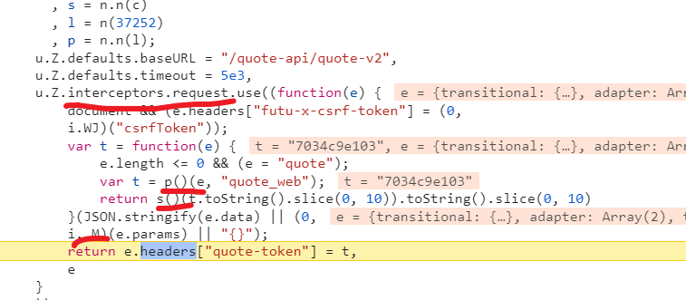
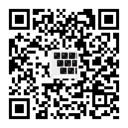

# 富途牛牛爬虫

## 免责声明

该文章为学习使用，严禁用于商业用途和非法用途，否则由此产生的一切后果均与作者无关！如有侵权，请私信联系作者删除

**未经允许不得转载**

## [配套视频链接](https://www.bilibili.com/video/BV17Uade8Eva/?spm_id_from=333.999.0.0&vd_source=422ea32eb3dde7f18a3e21011f8e4b74)

```
https://www.bilibili.com/video/BV17Uade8Eva/?spm_id_from=333.999.0.0&vd_source=422ea32eb3dde7f18a3e21011f8e4b74
```


## 逆向目标

某途牛网站请求头quote-token参数

URL地址（base64解密）：解密网站：https://base64.us/

```
aHR0cHM6Ly93d3cuZnV0dW5uLmNvbS9xdW90ZS91cz9nbG9iYWxfY29udGVudD0lN0IlMjJwcm9tb3RlX2lkJTIyJTNBMTM3NjYsJTIyc3ViX3Byb21vdGVfaWQlMjIlM0EyNCU3RCZzZWN1cml0eV9pZD04MDI5ODcwODc4NjIzMw==
```


## 分析

通过搜索quote-token定位到加密位置 




打断点 翻页 看看传进来的参数是什么

可以看到 加密位置是在请求拦截器里面 

e是一个对象

~~~
{
    "transitional": {
        "silentJSONParsing": true,
        "forcedJSONParsing": true,
        "clarifyTimeoutError": false
    },
    "adapter": [
        "xhr",
        "http"
    ],
    "transformRequest": [
        null
    ],
    "transformResponse": [
        null
    ],
    "timeout": 5000,
    "xsrfCookieName": "XSRF-TOKEN",
    "xsrfHeaderName": "X-XSRF-TOKEN",
    "maxContentLength": -1,
    "maxBodyLength": -1,
    "env": {},
    "headers": {
        "Accept": "application/json, text/plain, */*",
        "futu-x-csrf-token": "N3gukfN_I-OkjaMx3JqUQe2c"
    },
    "baseURL": "/quote-api/quote-v2",
    "params": {
        "marketType": 2,
        "plateType": 1,
        "rankType": 1,
        "page": 1,
        "pageSize": 50
    },
    "method": "get",
    "url": "/get-stock-list"
}
~~~


其中e.params就是我们的查询参数  变量为page  

**通过p方法 s方法  i._M方法 最终生成了我们需要的参数quote-token**

接下来看一下这些方法到底是什么 打上断点分析

跟踪p方法最终可以跟到是一个HMAC


往下看可以看到有一个HmacSHA512

通过与标准加密算法来比对看是不是标准加密

控制台输入：new p.HMAC.init(t,"1").finalize("1").toString()

跟标准算法比对 结果一致


然后直接用js模拟  需要安装node库  crypto-js 

npm install crypto-js --save

```
const CryptoJS = require("crypto-js")
function HMACEncrypt(text,key) { 
    return CryptoJS.HmacSHA512(text, key).toString();
}
```

接下来看一下s方法是什么 继续打断点分析 


感觉是一个sha加密 具体是sha1,256,还是其他的不太好判断 继续比对标准加密算法

继续通过1来对比


发现一致 就是一个sha256算法 然后继续用js来模拟

```
const CryptoJS = require("crypto-js")
function s(text,key){
    return CryptoJS.SHA256(text, key).toString();
}
```

最后我们来看一下i._M方法是什么

发现它就是一个N方法


最后把他们封装成一个get_token函数  把param参数传过去

```
const CryptoJS = require("crypto-js")
function s(text,key){
    return CryptoJS.SHA256(text, key).toString();
}
N = function(e) {
                var t = {};
                for (var n in e)
                    if (Object.prototype.hasOwnProperty.call(e, n) && void 0 !== e[n]) {
                        var r = e[n];
                        t[n] = String(r)
                    }
                return JSON.stringify(t)
            }
function HMACEncrypt(text,key) {

    return CryptoJS.HmacSHA512(text, key).toString();
}
function sss(e) {

    var t = function(e) {
                    e.length <= 0 && (e = "quote");
                    var t = HMACEncrypt(e, "quote_web");
                    return s(t.toString().slice(0, 10)).toString().slice(0, 10)
                }(JSON.stringify(e.data) || (0,
                N)(e.params) || "{}");
                return t
}
ee = {
    "transitional": {
        "silentJSONParsing": true,
        "forcedJSONParsing": true,
        "clarifyTimeoutError": false
    },
    "adapter": [
        "xhr",
        "http"
    ],
    "transformRequest": [
        null
    ],
    "transformResponse": [
        null
    ],
    "timeout": 5000,
    "xsrfCookieName": "XSRF-TOKEN",
    "xsrfHeaderName": "X-XSRF-TOKEN",
    "maxContentLength": -1,
    "maxBodyLength": -1,
    "env": {},
    "headers": {
        "Accept": "application/json, text/plain, */*",
        "futu-x-csrf-token": "N3gukfN_I-OkjaMx3JqUQe2c"
    },
    "baseURL": "/quote-api/quote-v2",
    "params": {
        "marketType": 2,
        "plateType": 1,
        "rankType": 1,
        "page": 1,
        "pageSize": 50
    },
    "method": "get",
    "url": "/get-stock-list"
}
function get_token(s) {
    ee.params = s
    return sss(ee)
}

console.log(get_token());
```


通过python发请求测试 可以成功拿到数据 


## 源码获取

**关注微信公众号：庆哥爬虫  发送富途牛牛自动获取代码地址 **

